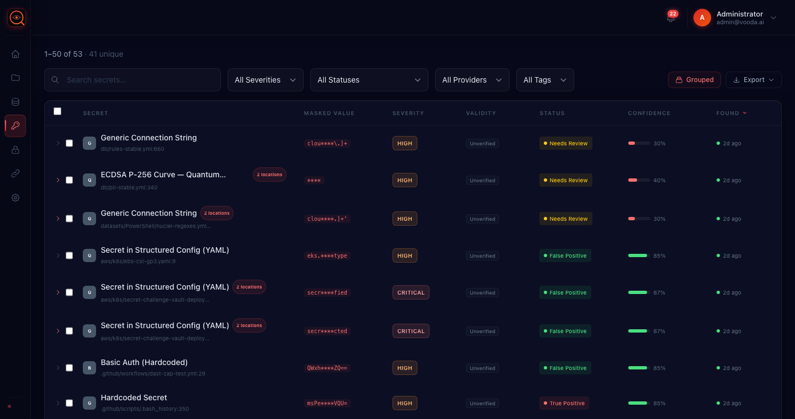

<p align="center">
  <picture>
    <source media="(prefers-color-scheme: dark)" srcset="logo/banner-dark.svg">
    <source media="(prefers-color-scheme: light)" srcset="logo/banner-light.svg">
    
  </picture>
</p>

<p align="center">
  <b>Find your leaked secrets — in code, tickets, cloud storage and CI/CD — before someone else does.</b><br>
  Self-hosted secret scanning with AI triage. Rules and regex find the candidates; an AI model triages them to cut the false positives — and it runs on a local model for <b>$0 in AI cost</b>.
</p>

<h4 align="center">
  <a href="https://vooda.ai">Website</a> ·
  <a href="#quickstart">Quickstart</a> ·
  <a href="docs/platform-reference.md">Docs</a> ·
  <a href="../../discussions">Discussions</a> ·
  <a href="../../issues">Issues</a>
</h4>

<p align="center">
  <a href="LICENSE.md"></a>
  
  <a href="../../stargazers"></a>
  <a href="../../issues?q=is%3Aissue+is%3Aopen+label%3A%22good+first+issue%22"></a>
</p>

<!--
  TODO(pre-launch): replace this static screenshot with a recorded demo GIF.
  Suggested: 15-20s loop — `vooda scan` in a terminal finding a live key,
  cutting to the triage UI showing the AI verdict. Tracked on the go-public checklist.
-->
<p align="center">
  
</p>

<p align="center">
  <b>⭐ If Vooda looks useful, <a href="../../">give it a star</a>.</b><br>
  <sub>It's the one-second thing that most helps the next engineer with a leaked key find this instead of shipping it — and it keeps the community edition funded.</sub>
</p>

## Why Vooda

- **Secrets leak everywhere, not just in code.** Vooda scans your Git repos *and* the other places credentials hide — tickets, cloud storage, CI/CD logs and container images. One scanner for the whole sprawl ([full list](#what-vooda-scans)).
- **Detection that doesn't drown you.** A broad, regularly-updated rule set finds candidates with regex and signatures; then an AI triage pass classifies each hit as true or false positive with a confidence score — so you review findings, not noise.
- **$0 AI cost with a local model.** Point the triage step at a model you host — Ollama, vLLM, LM Studio — and there's no per-token API bill and nothing leaves your network. Prefer a frontier API? That works too; it's your call, not ours.
- **It checks whether the key actually works.** Vooda verifies findings against the provider where it safely can. A revoked key and a live production key are not the same emergency, and your queue shouldn't pretend they are.
- **Secrets belong to identities.** The credentials Vooda finds are the keys to service accounts and CI tokens. Enterprise takes it further — checking which are already managed by a vault (HashiCorp, AWS, Azure, GCP, CyberArk), flagging the ones that aren't, and writing rotated values back where it can.

## What Vooda scans

Credentials don't stay in source code. They get attached to a Jira ticket, dumped into a CI/CD log, or baked into a container image. Vooda goes after all of it with **one detection pipeline for every source**:

> **the adapter pulls the content → detection rules and regex flag credential candidates → live verification checks whether they still work → an AI model triages out the false positives.**

| Category | Sources |
|---|---|
| **Code & history** | Git working tree and full commit history — GitHub, GitLab, Bitbucket |
| **Tickets & issues** | Jira, ServiceNow, Azure DevOps |
| **Cloud storage** | Amazon S3, Google Cloud Storage, Azure Blob |
| **Pipelines & artifacts** | Container registries, CI/CD logs, container images |

Connect them under **Sources** in the UI — Git repos and the CLI need no setup at all. [Enterprise](#community-vs-enterprise) adds more source families — team chat, wikis, and additional ticketing and object-store connectors.

## Quickstart

You need Docker. That's it.

```bash
git clone https://github.com/virantisofficial/vooda.ai.git && cd vooda.ai
./install.sh          # macOS/Linux  (or install.bat on Windows)
```

The installer checks prerequisites, lets you pick **production** mode (the real build — recommended) or **development** mode (`next dev` + hot reload), generates the required secrets, brings the stack up, and seeds the admin account — **printing its one-time password to the console**. Later, `./install.sh update` pulls the latest release and rebuilds without touching your data.

Once it's up (production mode), log in as **`admin@vooda.ai`** with the password the seed step printed:

| | |
|---|---|
| Web UI | http://localhost:3000 |
| API docs | http://localhost:8000/api/docs |
| Health | http://localhost:8000/api/health |

Development mode serves the same on ports **3001 / 8001** instead.

> [!IMPORTANT]
> The seeded administrator account is for first login only. **Change the password before exposing an instance to a network.** See [DEPLOYMENT.md](DEPLOYMENT.md).

<details>
<summary><b>Manual setup, without the installer</b></summary>

```bash
cp .env.example .env
# Set POSTGRES_PASSWORD and SECRET_KEY in .env before starting — the file
# header has `openssl` one-liners to generate them. The stack will not
# boot with them empty.

# Pick a run mode by copying ONE override to docker-compose.override.yml:
cp docker-compose.override.prod.example.yml docker-compose.override.yml   # production (:3000)
# cp docker-compose.override.example.yml    docker-compose.override.yml   # development (:3001, hot reload)

docker compose up -d --build
docker compose exec api python -m infra.scripts.seed   # creates admin@vooda.ai, prints the password
```

The base `docker-compose.yml` keeps `api` and `web` on the internal Docker network (production deployments put a reverse proxy in front); the override you copy publishes them on your host. Migrations run automatically on API startup.
</details>

Prefer the CLI? It ships as a container — build it once, then alias it:

```bash
docker build -f infra/docker/Dockerfile.cli -t vooda/cli:latest .
alias vooda='docker run --rm -v "$PWD:/work" -w /work vooda/cli:latest'

vooda scan .                    # working tree
vooda scan . --history          # full git history
vooda scan . --format sarif     # for CI
```

No prebuilt image is published yet. See [infra/ci/README.md](infra/ci/README.md) for the CI runner setup and registry-publishing steps.

## Bring your own model (BYOM)

AI triage sends your code context and candidate credential values to a model. Point it at a model **you host** and two things happen: none of that data leaves your network, and there's **no AI bill** — local inference is $0 per token, however many findings you triage.

| Mode | What runs it | Cost |
|---|---|---|
| **Fully local** | Ollama, vLLM, LM Studio, LocalAI — or any OpenAI-compatible server you host | No API spend; it runs on your hardware |
| **Frontier API** | Anthropic, OpenAI or Google Gemini, called natively | Pay-as-you-go per token |
| **Any OpenAI-compatible endpoint** | Azure OpenAI, AWS Bedrock, OpenRouter, your own gateway | Whatever that endpoint charges |

New to BYOM? Mistral Small 24B is the local model we've evaluated most heavily, and where we'd start.

Frontier providers are set by environment variable:

```bash
AI_PROVIDER=claude                       # claude | openai
ANTHROPIC_API_KEY=sk-ant-...
AI_MODEL=claude-sonnet-4-20250514
```

Local and OpenAI-compatible endpoints are configured in the UI, under **Integrations → AI providers** — set the endpoint URL and leave the API key blank. If Vooda runs in Compose and the model runs on your host, reach it as `http://host.docker.internal:11434`, not `localhost`.

For a genuinely air-gapped deployment, also switch off outbound credential verification — that's the other thing that talks to the internet:

```bash
VERIFICATION_ENABLED=false   # scans still complete; findings stay not_validated
```

## Community vs Enterprise

**The whole scan engine is in this repository.** The full detection engine, every detector module, verification, and AI triage — no `ee/` directory, no crippled code. What you self-host is a real, production-grade secret scanner: **free for non-commercial use**, and available to businesses under a commercial licence.

Both editions are self-hosted — you run Vooda on your own infrastructure either way. **Enterprise** is the same software under a commercial licence, with more: the complete set of source connectors, secret-manager coverage with rotation write-back, fresh signatures the day they ship, and a support line with an SLA.

| | Community (this repo) | Enterprise ([vooda.ai](https://vooda.ai)) |
|---|---|---|
| Full scan engine | ✅ | ✅ |
| Scan sources | Code + issue tracking, cloud storage, CI/CD | ✅ Adds team chat, wikis & more connectors |
| Secret verification | ✅ | ✅ |
| AI triage | ✅ bring your own model or API key | ✅ included — no key, no GPU to run |
| Local-model triage ($0 AI cost) | ✅ | ✅ |
| CLI, pre-commit, CI gates | ✅ | ✅ |
| Compliance reporting | ✅ | ✅ |
| Secret-manager coverage & rotation write-back — Vault, AWS, Azure, GCP, CyberArk | — | ✅ |
| **Detection & signature updates** | published here **monthly** (~30 days behind) | **continuous** — new detectors the day they ship |
| Hosting | ✅ self-hosted (on-prem) | ✅ self-hosted (on-prem) |
| Verification | your egress, your rate limits | tuned for scale, priority verifier coverage |
| **Support** | community forum, best-effort | **SLA-backed**, named contact, priority response |
| Deployment help | docs | onboarding, air-gapped, custom detectors |

Three honest asterisks on the community edition:

- **Free for non-commercial use.** The community edition is free for individuals, non-commercial research and education, and non-profits. Business or for-profit use — including internal production use — needs a commercial licence (see [License](#license)).
- **A curated set of sources.** Community scans your code plus the primary connector in each category — issue tracking (Jira, ServiceNow, Azure DevOps), cloud storage (Amazon S3, Azure Blob, Google Cloud Storage), and CI / build surfaces (container registries, CI/CD logs, container images). Enterprise unlocks the rest: team chat (Slack, Teams, Mattermost), wikis (Confluence, Notion, SharePoint), additional ticketing and object-store connectors, and secret-manager coverage with rotation write-back (HashiCorp Vault, AWS, Azure, GCP, CyberArk).
- **Detection updates land monthly.** You get the same rules and signatures Enterprise gets — just on a ~30-day lag, not the continuous feed. A `git pull` always brings you to the latest community release; the engine itself never lags.
- **Support is the community forum.** [Discussions](../../discussions) and [Issues](../../issues), answered best-effort by us and other users — no guaranteed response time, no phone number. That's what Enterprise is for.

Why offer it this way? Because the way you learn Vooda belongs in your stack is to run it on your own secrets. It stays free for non-commercial use — and when you're ready to run it in a business, a commercial licence is straightforward, with Enterprise adding signatures live the day they ship, the full set of connectors, and someone accountable with an SLA when a real key leaks.

## Roadmap

Tracked in the open. See [issues](../../issues) and [Discussions](../../discussions) — near-term themes:

- More non-git source adapters — additional chat, wiki and ticketing systems
- Ephemeral-credential migration guidance
- Faster incremental history scanning on very large monorepos
- More provider verifiers

Want something on here? Open a discussion. What users actually ask for beats what we guess.

## Community — and how to help

Vooda is built in the open, and the community edition gets better the more people use it and push back on it. If it's useful to you, here's what genuinely helps — every one of these takes seconds:

- **⭐ Star the repo.** [Star it here](../../) — it's the single biggest signal, and it's how the next engineer with a leaked key finds Vooda instead of shipping the key.
- **👀 Watch releases.** [Watch → Releases](../../) so you hear when new detectors and features land.
- **❤️ React and join in.** Give a 👍 or ❤️ on the [launch discussion](../../discussions), ask a question, or show off a secret you caught. Reactions are how we learn what matters to you.
- **🐛 Report a miss.** A [missed secret or a false positive](../../issues) is the most valuable thing you can send us — it sharpens detection for everyone.
- **📣 Tell someone.** A post, a tweet, or a link in your security channel. Word of mouth is how a security tool earns trust.

Every star, reaction, and report keeps the community edition strong — and free.

## Contributing

We'd genuinely like the help — especially on detection rules, where a gap you hit in your own repo is a gap everyone has.

Start with a [`good first issue`](../../issues?q=is%3Aissue+is%3Aopen+label%3A%22good+first+issue%22). Each one names the file and what "done" looks like. Then read [CONTRIBUTING.md](CONTRIBUTING.md) — it walks through adding a detector end to end.

One thing to know up front: we ask contributors to sign a [CLA](CLA.md), because Virantis also sells a commercial edition and we need the right to sublicense contributions. A bot prompts you on your first PR. You keep copyright in your work. We explain the reasoning honestly in [CLA.md](CLA.md).

> **Heads up:** this repo deliberately contains planted, non-functional credentials under `tests/` — that's what a secret scanner's test suite is made of. Your scanner will alert on it. If you find one that's genuinely **live**, please report it privately via [SECURITY.md](SECURITY.md).

## License

Vooda is **source-available** under the [Vooda Community Licence, Version 1.0](LICENSE.md).

We don't call it open source, because it isn't — it's not an OSI-approved license, and claiming otherwise would be dishonest. Here's what it actually means:

| | |
|---|---|
| Use it for personal, research, or non-profit work — free? | **Yes.** Non-commercial use is free: individuals, non-commercial research and education, and non-profits. |
| Use it commercially, or inside a for-profit company? | **A commercial licence is required** — including production or internal business use by a company, and paid consulting, hosting, or SaaS. [Talk to us](https://vooda.ai). |
| Modify and fork it? | **Yes, for non-commercial use.** Don't call your fork "Vooda" (see [TRADEMARK.md](TRADEMARK.md)), keep the notices, and note that the licence asks you to share your modifications back (see [LICENSE.md](LICENSE.md), §4). |
| Resell, sublicense, or offer it as a hosted service? | **No** — that requires a commercial licence. |

Building on Vooda for a business? A commercial licence removes the non-commercial restriction; the **Enterprise** tier adds the full connector set, a continuously-updated detection feed, and SLA-backed support. Email **hello@vooda.ai**.

Third-party components: [NOTICE.md](NOTICE.md). Trademark policy: [TRADEMARK.md](TRADEMARK.md).

## Enterprise

Running Vooda in a business? Commercial use requires a licence. **Enterprise** is the full commercial tier — the same self-hosted product with the complete set of source connectors, a continuously-updated detection feed, SLA-backed support, and onboarding / air-gapped deployment help.

**[vooda.ai](https://vooda.ai)**

---

<p align="center">
  <sub>Built by <a href="https://virantis.com/">Virantis</a> · <a href="SECURITY.md">Security</a> · <a href="CODE_OF_CONDUCT.md">Code of Conduct</a></sub>
</p>
